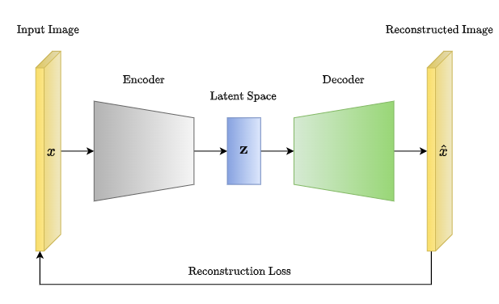

# Variational Autoencoder (VAE) for EMNIST Letter Reconstruction

## Project Overview

This project implements a Variational Autoencoder (VAE) for reconstructing EMNIST letters. The VAE is a type of generative model that learns to encode and decode data, enabling the generation of new samples similar to the training data.

## Problem Statement

The objective is to reconstruct EMNIST letters using a VAE, capturing the underlying structure of the data while generating new samples with similar characteristics.

## Solution

### Preprocessing EMNIST Dataset

The EMNIST dataset is preprocessed to prepare it for training. This involves data cleaning, normalization, and partitioning into training and testing sets.

### Building the Tensor Graph

The architecture of the VAE is defined, including the encoder and decoder networks. The VAE model is trained using TensorFlow, optimizing a loss function that balances reconstruction accuracy and latent space regularization.

### Dropout for Regularization

Dropout regularization is applied to the VAE model to prevent overfitting and improve generalization performance. Dropout randomly deactivates a fraction of neurons during training, forcing the network to learn more robust features.

## Tools Used

- Python
- TensorFlow
- NumPy
- Matplotlib

## Data Preprocessing Techniques Utilized

- Normalization
- Train-test Split
- Data Cleaning

## Embedding

The VAE learns a low-dimensional embedding of the EMNIST letters, capturing the essential features necessary for reconstruction.

## Optimizers

The Adam optimizer is employed to minimize the VAE's reconstruction loss and KL divergence, efficiently updating the model's parameters during training.

## Crossfold

Crossfold validation is not applicable in this project as the dataset is pre-partitioned into training and testing sets.

## Repository Content

- `my_variational_auto_encoder.py`: Implementation of the VAE architecture.
- `data_prepro.py`: Code for preprocessing the EMNIST dataset.
- `plot_and_merge.py`: Utility functions for plotting and visualizing results.
- `README.md`: Project documentation.

## Running the Code

The following scripts can be executed to train the VAE and visualize the results:

1. [Variational Autoencoder Training Code](my_variational_auto_encoder.py)
2. [Plot and Merge](my_variational_auto_encoder.py)
3. [Real-time Face Mask Detection](real_time_face_mask_detection.py)

## Contact Information

For any inquiries, please contact: gaddisaolex@gmail.com
